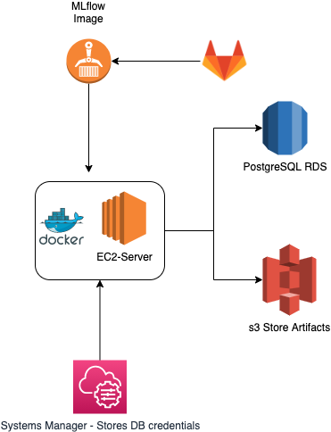
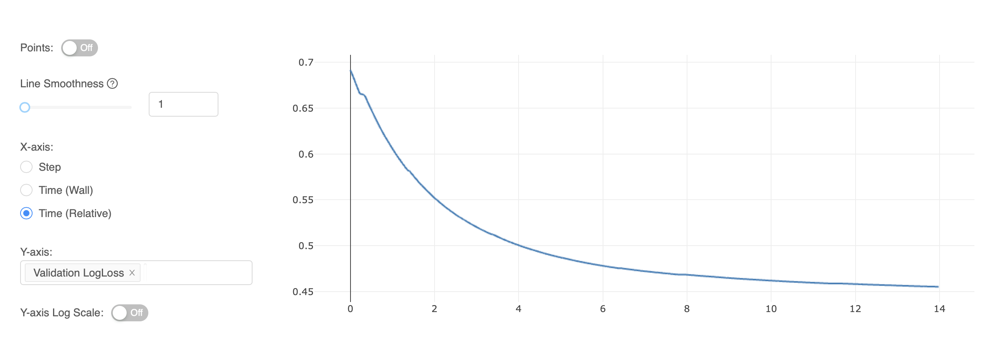

# MLflow Server on EC2 using RDS and s3 as backend services

Mlflow is an open-source platform to manage the ML lifecycle, including experimentation, reproducibility, deployment, and a central model registry.

## Architecture



## IAM Permissions
The EC2 instance requires the following policies:
- *Read-Write* from the s3 bucket.
- *AmazonEC2ContainerRegistryReadOnly*
- *Read Parameters* from SSM:
```json 
{
    "Version": "2012-10-17",
    "Statement": [
        {
            "Sid": "VisualEditor0",
            "Effect": "Allow",
            "Action": [
                "ssm:GetParameters",
                "ssm:GetParameter"
            ],
            "Resource": "arn:aws:ssm:us-east-1:{ACCOUNT_ID}:parameter/mlflow/*"
        }
    ]
}
```
- KMS decrypt for encrypted SSM parameters
```json
{
    "Version": "2012-10-17",
    "Statement": [
        {
            "Sid": "VisualEditor0",
            "Effect": "Allow",
            "Action": "kms:Decrypt",
            "Resource": "arn:aws:kms:us-east-1:{ACCOUNT_ID}:key/{KEY-ID}"
        }
    ]
}
```

## Code Structure

The code was executed on AWS AMI: Amazon Linux 2

### Database/:

Creates the database for Mlflow to store its files:

```sql
CREATE DATABASE mlflow;
```

### Container/:

Contains the Dockerfile for building the Image.

The image is built and pushed to the ECR through the Gitlab-CI. Check the gitlab-ci.yml for the full code:
```bash
docker build -t $DOCKER_REGISTRY/$APP_NAME:latest container/
aws ecr describe-repositories --repository-names $APP_NAME || aws ecr create-repository --repository-name $APP_NAME
aws ecr get-login-password --region $AWS_DEFAULT_REGION | docker login --username AWS --password-stdin $DOCKER_REGISTRY
docker push $DOCKER_REGISTRY/$APP_NAME:latest
 ```

### Shell Script/:
- All secret credentials are stored on AWS SSM under path mlflow/:

```bash
ACCOUNT_ID=`aws sts get-caller-identity --output text --query 'Account'`
DB_PASS=`aws ssm get-parameters --region us-east-1 --names /mlflow/DB_PASS --with-decryption --query "Parameters[0].Value" --output text`
DB_HOST=`aws ssm get-parameters --region us-east-1 --names /mlflow/DB_HOST --query "Parameters[0].Value" --output text`
DB_USER=`aws ssm get-parameters --region us-east-1 --names /mlflow/DB_USER --query "Parameters[0].Value" --output text`
```

- Installing Docker. Adding ec2-user to the docker group so you can execute Docker commands without using sudo:

```bash
sudo yum update -y
sudo amazon-linux-extras install docker
sudo service docker start
sudo usermod -a -G docker ec2-user
```

- **Configure Docker to start on boot** (https://docs.docker.com/engine/install/linux-postinstall/#configure-docker-to-start-on-boot):

```sudo systemctl enable docker.service```

- **Setting amazon-ecr-credential-helper**: This means that developers or build scripts using the Docker CLI no longer have to explicitly use the ECR API to retrieve a secure token, nor call docker login with this token before pushing or pulling container image. (https://aws.amazon.com/blogs/containers/amazon-ecr-credential-helper-now-supports-amazon-ecr-public/)
```bash
mkdir -p /home/ec2-user/.docker

sudo cat <<-END >> /home/ec2-user/.docker/config.json
{
    "credHelpers": {
        "public.ecr.aws": "ecr-login",
        "${ACCOUNT_ID}.dkr.ecr.us-east-1.amazonaws.com/mlflow:latest": "ecr-login"
    }
}
END

# Change the user and/or group ownership of a given file, directory, or symbolic link
chown -R ec2-user:ec2-user /home/ec2-user/.docker
```

- Pulling Images from ECR:

```bash
sudo -u ec2-user docker pull $ACCOUNT_ID.dkr.ecr.us-east-1.amazonaws.com/mlflow:latest
# Running container. The container is configured to always restart. Port 5000 is available to services outside of Docker.
docker run --env BUCKET=s3://mlflow-artifacts/ --env USERNAME=$DB_USER --env PASSWORD=$DB_PASS \
--env HOST=$DB_HOST --env PORT=5432 --env DATABASE=mlflow \
-p 5000:5000 -d --restart always --name mlflow-server $ACCOUNT_ID.dkr.ecr.us-east-1.amazonaws.com/mlflow:latest
```

## Usage
After pushing the image to ECR, run the command `bash run_container.sh`; it will build the docker image for you.


## MLFlow - User Guide
1. Set ML_FLOW_TRACKING_URI:
```
ML_FLOW_TRACKING_URI = "http://localhost:5000"
```
2. Create a new experiment:
```
mlflow.set_experiment("{project-name}-{user}")
```

3. Run mlflow's APIs for starting and managing MLflow runs:

```mlflow.start_run({name-of-your-runner})
In the end: mlflow.end_run()
```

4. Logging model Parameters:
```python
# XGBoost Params
param_dist = {
    'objective':'binary:logistic',
    'n_estimators': 1000,
    'scale_pos_weight' : count_notchurn/count_churn,
    'max_depth' : 4,
    'min_child_weight': 6,
    'learning_rate': 0.005,
    'subsample': 0.8,
    'colsample_bytree': 0.7,
    'gamma': 0,
    'seed': 42
}

mlflow.log_params(param_dist)
```

5. Logging Metrics:
- Single metrics
```python
mlflow.log_metric('Recall', recall)
mlflow.log_metric('Precision', precision)
mlflow.log_metric('Balanced Accuracy', balanced_accuracy)
mlflow.log_metric('F1', f1)
```
- Logging metrics per epochs:
```python
# For XGboost model
results = model.evals_result() # Get metric lists
eval_metric_result = 'logloss'

for i, metric in enumerate(results['validation_1'][eval_metric_result]):
    mlflow.log_metric('Validation LogLoss', metric, step=i)
```



6. Save Images: You can save, for example, SHAP summary_plot images:

```python
shap.summary_plot(shap_values, X_test, max_display=50, show=False)
fig_shap = 'SHAP_Xgboost.png'
pyplot.savefig(fig_shap, bbox_inches='tight')

mlflow.log_artifact(fig_shap)
```

7. Save Model: You can also store the entire model:
```python
mlflow.xgboost.log_model(model, "XGboost")
```
